# 基于LLaMA3大模型构建项目

从零构建千万参数规模的中文大语言模型，支持预训练、指令微调和推理蒸馏全流程。基于类LLaMA3架构设计，专注中文场景优化。

## 模型架构
### 核心技术
- **基础组件**：从零实现 RMSNorm/SwiGLU/RoPE
- **注意力机制**：分组多头注意力（Grouped Query Attention）
- **位置编码**：旋转位置编码（RoPE）
- **生成策略**：温度采样+Top-p采样


## 训练流程
1. **预训练阶段**（Pretrain）
   - 数据：匠数大模型数据集（过滤优化）
   - 目标：语言建模（CLM）
   - 技术：混合精度训练，梯度累积策略

2. **指令微调**（SFT）
   - 数据：匠数SFT数据集（512/1024双阶段）
   - 特性：指令loss掩码机制
   - 规模：10B token训练量

3. **R1推理蒸馏** (distill)
   - 数据：Deepseek-R1中文蒸馏数据
   - 方法：黑盒蒸馏策略
   - 效果：增强推理链生成能力

  ## 代码结构
```text
├── train_tokenizer.py      # 分词器训练
├── Config.py               # 模型超参数配置
├── model.py                # 核心模型架构实现
├── dataset.py              # 训练数据加载
├── pretrain.py             # 预训练主程序
├── SFT.py                  # 基础指令微调（512 tokens上下文）
├── SFT_long.py             # 长文本指令微调（1024 tokens上下文）
├── distill.py              # R1推理蒸馏实现
├── distill_1.5epoch.py     # R1推理蒸馏实现优化：在epoch=1.5时保存
├── model_eval.py           # 模型交互式测试脚本
└── README.md
```

## 实验记录
- 环境：
  - python版本：3.12
  - torch版本：2.5.1+cu124
  - transformers版本：4.49.0
  - 单机1卡4090/24G
  - 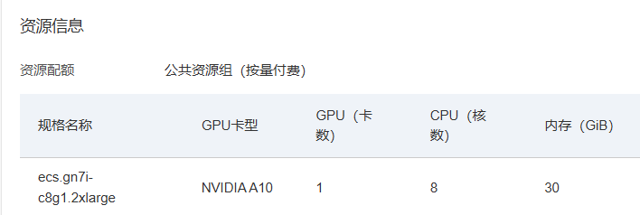
### 预训练Pretrain
4090/24G，跑2个epoch，每个epoch约80min，总时长<3h

  - 小实验：上述都刚刚跑到总step数的10%左右就停掉了
    - 深紫色：bs=80，梯度累积=2，wramup=False，lr=5e-4
    - 橘黄色：bs=80，梯度累积=4，warmup=True（ratio=0.03），lr=5e-4
    - 青色：bs=80，梯度累积=4，warmup=True（ratio=0.1），lr=5e-4
    - 浅紫色：bs=80，梯度累积=4，warmup=True（ratio=0.1），lr=5e-5
    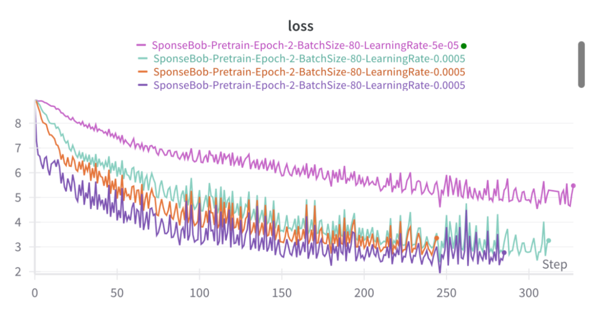

  - 蓝色：bs=80，梯度累积=4
  - 绿色：bs=84，梯度累积=8
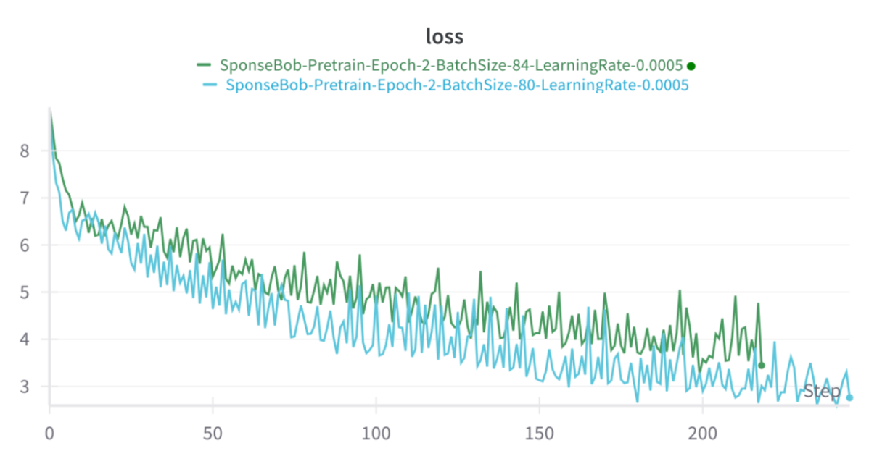


  - 绿色：学习率0.004
  - 橙色：学习率0.001
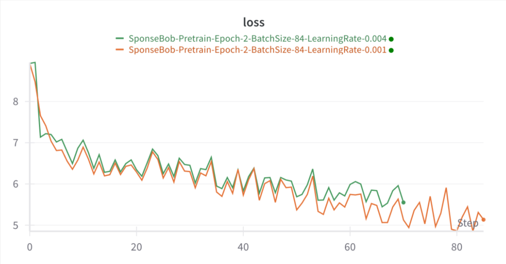

从收敛情况来看，等效batch_size=160(batch_size * gradient_accumlation)左右是个不错的实践.
- 最终选择：epochs=1,batch_size=70, 梯度累积=2 ，lr=5e-4, warmup=None
  - 显存峰值：23G/24G（利用率还是比较高的）
  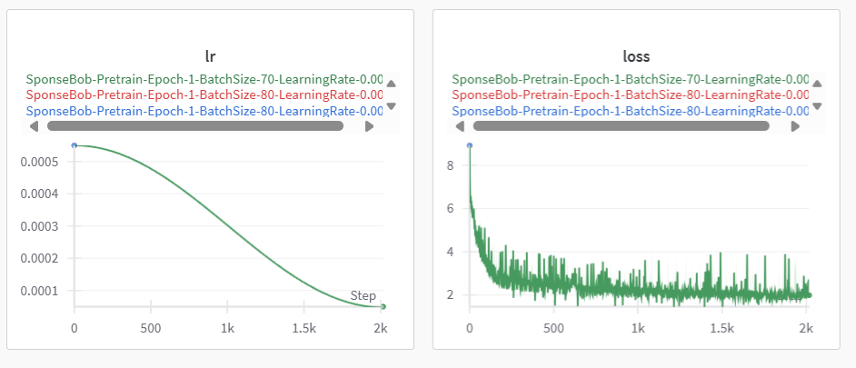

#### 执行推理过程

`python eval_model.py --model_mode 0`


可以看到pretrain模型本身是不具备问答能力的，只是在学词语接龙

### SFT训练

SFT的代码大量继承了Pretrain的代码，仅仅数据加载做了改变，SFT类数据集定义参考dataset.py文件

- SFT数据
  - sft512.jsonl(7.1G)，由匠数科技的SFT数据(24G)清洗而成，筛选出了总长度小于512的部分

  - 数据格式为：
```text
 {
    "conversations": [
        {"role": "user", "content": "你是谁"},
        {"role": "assistant", "content": "我是SbongeBob"},
        {"role": "user", "content": "再见"},
        {"role": "assistant", "content": "再见！"}
    ]
}
```
- 使用sft_mini_512.jsonl数据跑，单个epoch时间约为**80min**，epochs=1 ,batch_size=75, 梯度累积=8 ，lr=5e-4, warmup=None

  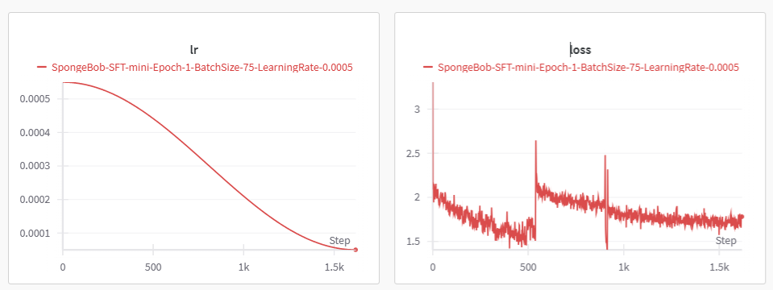

- 使用sft_512.jsonl数据跑，单个epoch时间约为6.7h，epochs=1 ,batch_size=84, 梯度累积=2 ，lr=5e-4, warmup=None
  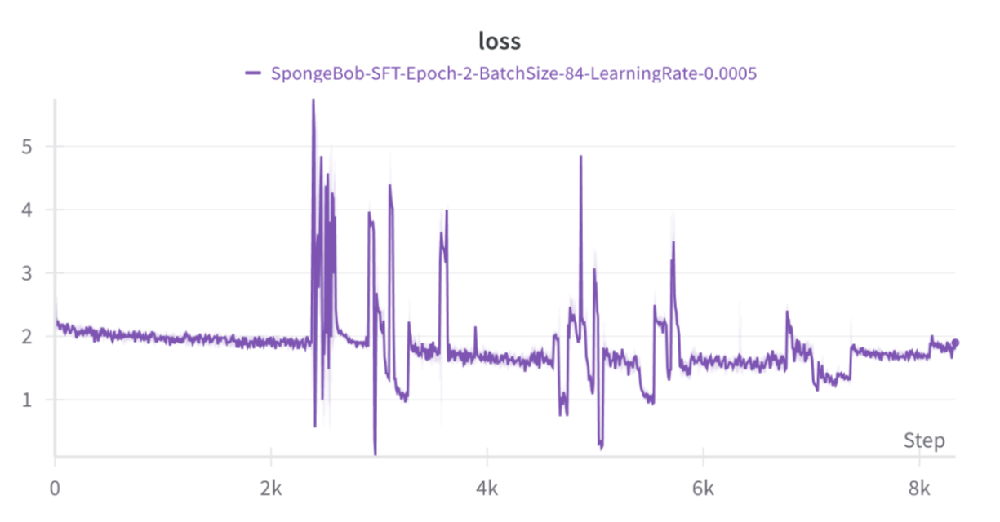

#### 推理

- 执行推理过程
  -  `python eval_model.py --model_mode 1` 

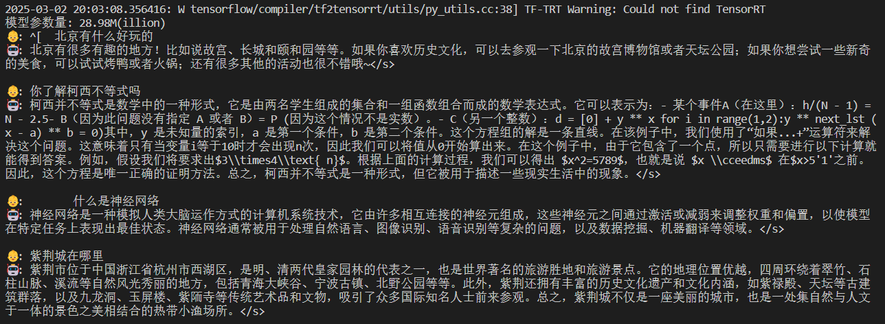

#### 长文本训练能力


- 使用sft_1024.jsonl 训练，epochs=1,batch_size=28，lr=5e-4 ,梯度累积=8，max_seq_len=1024, warmup=None
  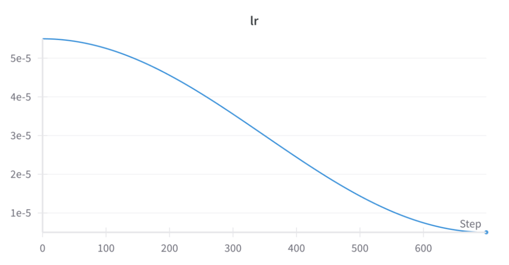
  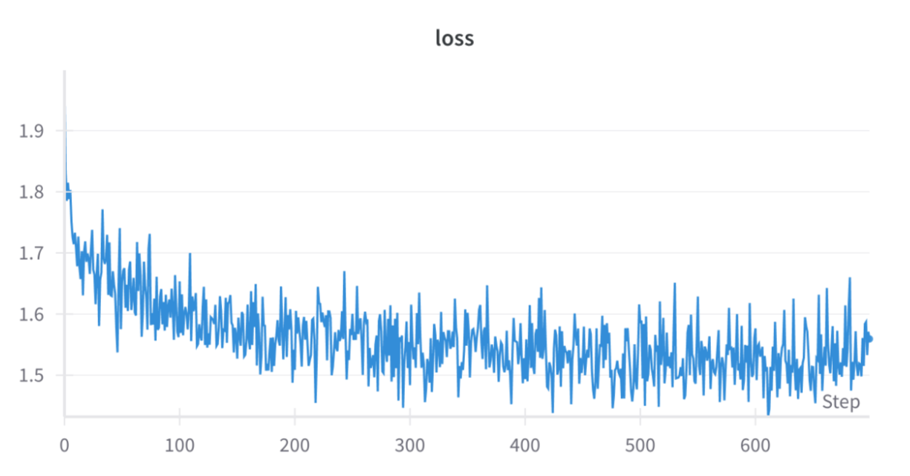


### R1蒸馏：Distill

这里我们采用黑盒蒸馏方法对拥有长文能力的model进行蒸馏，后面会对比长文能力的有无对蒸馏效果的影响。
- R1的输出格式一般采用在<think> 思考内容 </think> <answer> 回答</answer>的格式来产生慢思考过程。
- 结合开源社区的结论：R1的纯基于强化学习无法在<的3b模型上复现，因此我们优先采用蒸馏方法。
- 蒸馏数据使用r1_1024.jsonl(360M)，格式和SFT数据相似，如图：
```text
{"conversations":
[{"role": "user",
 "content": "请帮我写一个古风诗句，表达一种淡淡的哀愁和思念。"}, 
 {"role": "assistant", 
"content": "<think>\n好吧，用户让我帮他写一个古风诗句，主题是淡淡的哀愁和思念。首先，我需要理解他的需求。他可能希望这句诗能传达一种难以言喻的悲伤，但又不失古风的意境，这可能用于文学创作或者表达情感。\n\n我应该考虑古风诗的结构和常用词汇。古风诗常常使用自然意象，比如山水、 Places、四季等，来营造氛围。哀愁和思念可能涉及离别、思念、痛苦等情感。\n\n接着，我需要选择合适的词语来表达这些情感。比如“无尽有”可以表达无法言喻的悲伤，“空字”作为思念的代名词，这样既简洁又富有情感。如果季节有变化，换个季节会更有变化。\n\n然后是描绘场景，比如“天涯冷月”强调southenly的寒冷，增添夜晚的氛围，增加诗意。再加“孤影凄凄照”来表达内心的思念，最后一句“苦耐心犹未去”直接点明哀愁。\n\n最后，检查句子的对仗和节奏，确保流畅自然，符合古风的韵律。这样组合起来，应该能够满足用户的需求。\n</think>\n
<answer>\n无尽有，空字，若无云处。天涯冷月，孤影凄凄照，苦耐心犹未去。\n</answer>"}]}
```
- 鉴于我们的tokenizer对<think></think>编码效率低，需要4个token，因此模型对学习这种范式会略显困难，为了优先学习这种范式，我们会手动加大这些token的损失惩罚。

使用r1_1024.jsonl数据集进行训练，使用不同模型基座进行了两个版本的训练
- 使用SFT_1024.pth作为基座训练（经过1024数据训练）epochs=3，batch_size=30, lr=1e-6, 梯度累积=8，max_seq_len=1024, warmup=None
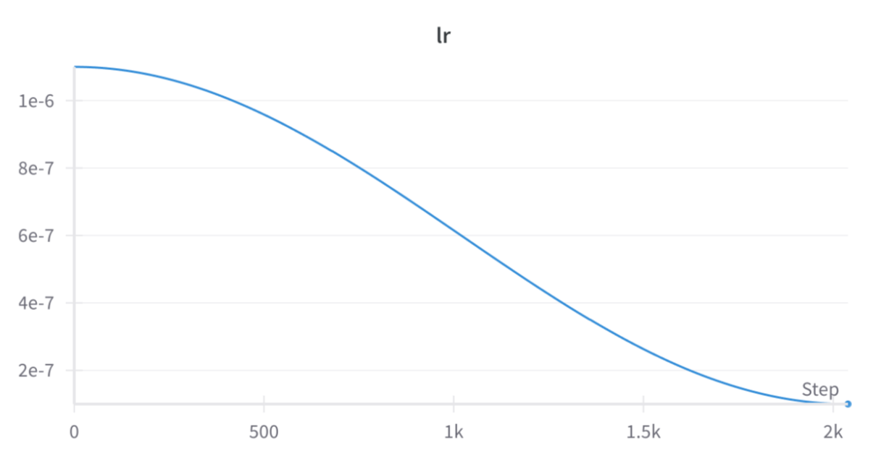
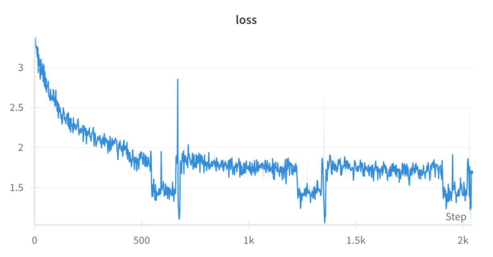


#### 插曲1：max_seq_len不够, 效果很差

最大长度不够导致效果很差


于是改为max_seq_len=1024

#### 插曲2：max_seq_len调上来内存爆了

- 第二轮epoch内存给爆了，偶买噶我宝贵的gpu资源……（蓝色曲线）


减小batchsize，增大梯度累积：accumlation steps从8到10，batchsize从28到24，跑通了！


#### 插曲3：幻觉反而变严重了

出现了复读，且不能按照思维链的方式思考

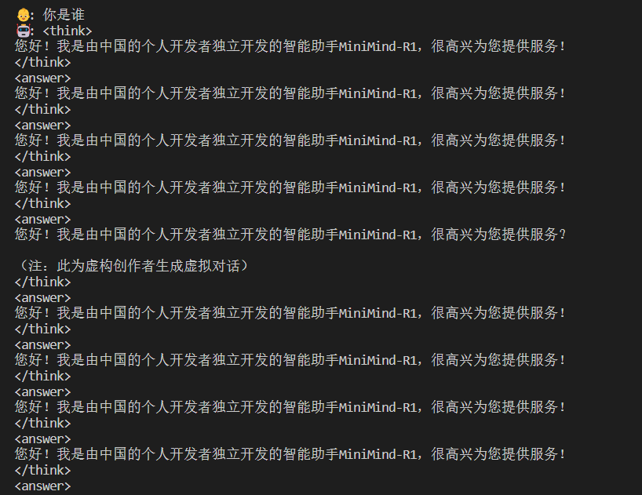

#### 最终方案：在1.5epoch时保存模型

- 观察loss曲线：每个epoch结束的突刺（Loss Spike）比较严重，导致最终保存的模型很不稳定

- 推测：训练数据有问题，在**每个epoch结尾有脏数据**（也不一定是客观上的脏数据，比如模型没有英文能力，如果最后部分数据有大量英文，那必然会让我们模型loss训飞），会导致模型训练不稳定。

- 尝试：在1.5个epoch（计数特定步数后另存新的pth）处保存一次，效果应该会好很多

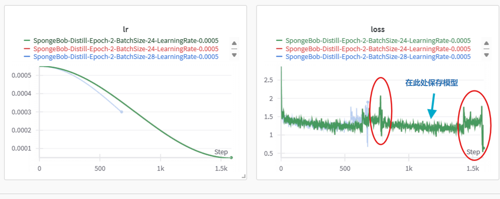

#### 最终推理效果

- 直接通过修改eval_model.py加载相应模型：distill_1.5epoch.pth
- python eval_model.py --model_mode 2

最终效果：基本ok！

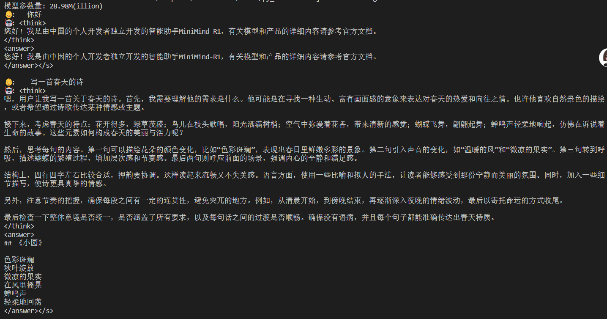

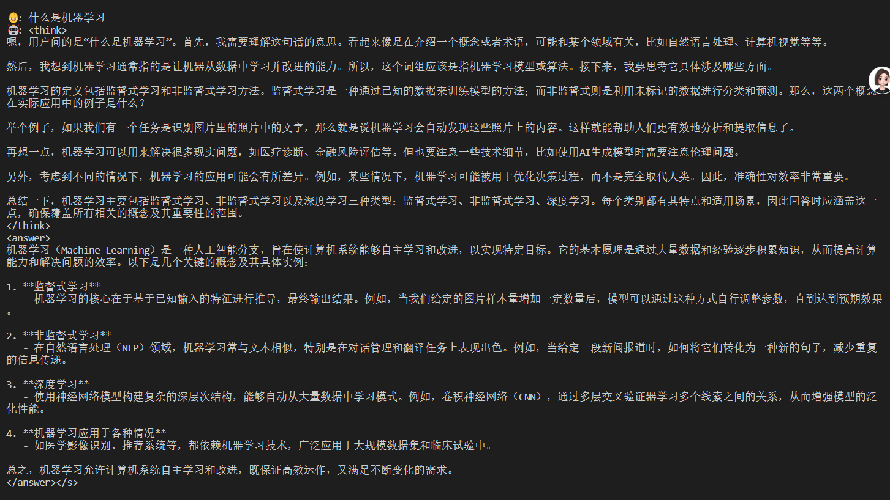
